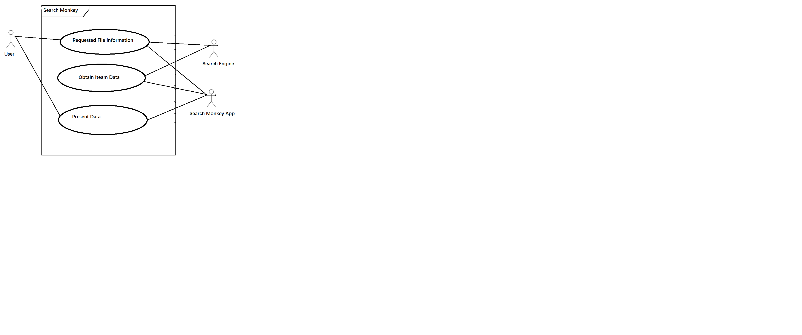
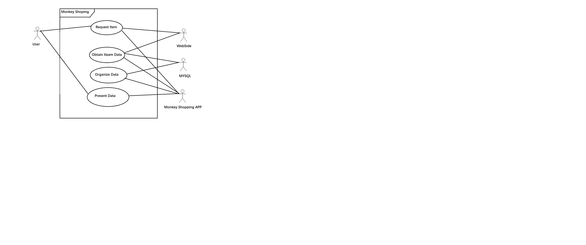

# Monkey Shoping App

## Project Abstract

### Open Source Project
	Power searching on your desktop without the pain. Perform powerful desktop searches without having to index your system using regular expressions. 
	User can search for file names and contents using powerful regular expression, and it also displays the content with match hiaghlight.
	Searchmonkey is made by its users for its users. It can be converted to any language and OS with ease.

## Project Relevance
	GitHub: for the team work, everyone can be assigned for different task, and also they can look at other branchs eayily to improvement or share their idea
	Object Oriented Design: this project is only using java. Java can hardly do without Object Oriented Design. this is an importeant goal for this course.
	Test Driven Development: For the big project, TDD is very using to help the project check part of project that run succeedfully such as a method or a class.
	Graphic User Interface: Although Java Swing is not popular today. But learning a GUI is still useful because most GUI engine is similar. SearchMonkey is using java swing for the panel. 
	
## Conceptual Design
	Using the search engine and basic panel from the SearchMonkey for the proposal.
	My proposal is improvement Search Monkey that is  similar to Google Shoping, but using different implementation approach.
	User can search the item in the Monkey Shoping App, then it will search for item price, image and relevant information from
	some major sites using powerful regular expression and MySQL. After sorting, user can scan offered information from the software.

## Background

<https://sourceforge.net/p/searchmonkey/java/ci/v3.2.1/tree/>

***Building***
- Do now work with NetBeans 8.2 in the beginning.
  So I add some config data in the settings.xml for maven:
    <mirror>
      <id>central-https</id>
      <url>https://repo.maven.apache.org/maven2</url>
      <mirrorOf>central</mirrorOf>
    </mirror>
	
  
- Next, I clear and build for this project. 
- First build is taking a long time as it is downloading many things but eventually succeed.

**Running**
- Select "Run Tests" from Run menu  in NetBeans or open the jar file, it works succeedfully 

## Required Resources
- _Group members should know about:
	Using MySQL and NetBeans
	Knowing about structure of web page
	Knowing java Swing or java GUI
- _Hardware and software resource required_
	Windows or MAC
	NetBeans 8.0(at least)
	MySQL
	Web Browser
	
